# Strategy Showdown

**Publicly documented trading algorithms, run side by side on the same data, the same months and the same costs. Every rule comes from its published paper or is labelled with how far it could be verified, every number shows its uncertainty, and every citation resolves to a real, checked source.**

[](https://github.com/Normansrule/strategy-showdown/actions/workflows/ci.yml)
[](https://github.com/Normansrule/strategy-showdown/actions/workflows/citations.yml)
[](https://securityscorecards.dev/viewer/?uri=github.com/Normansrule/strategy-showdown)

> **Educational tool. Not investment advice.** It never recommends trades, never connects to a broker and never moves money. Every backtest is hypothetical; past results do not predict future ones. See [DISCLAIMER](docs/DISCLAIMER.md).

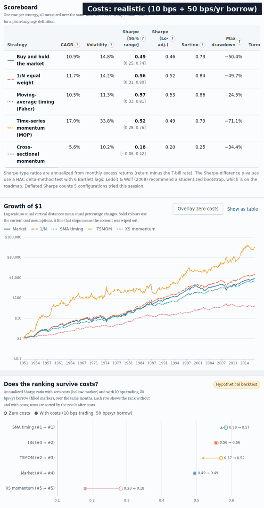

*Hypothetical backtest, 1951–2017 (the window set by time-series momentum's 24-month warm-up), US market and 12 industry portfolios. Data: Kenneth R. French Data Library, 2017 vintage, taken from the copy bundled in the `linearmodels` 7.0 Python package; whether that copy's industry portfolios are value- or equal-weighted is not documented (unverified). Frame 1: realistic costs. Frame 2: zero costs. Frame 3: short-term reversal added.*

---

## Why this exists

Most "strategy X beats the market" claims skip four things: identical test conditions, trading costs, statistical uncertainty, and the number of variants that were tried before the winner was picked. This project puts all four up front:

| Honesty problem | What the app does |
|---|---|
| Strategies tested on different periods | One **conditions hash** covers data fingerprint, universe, window, costs and rebalance rule. The runner **refuses** to compare runs whose hashes differ. The window starts where the *slowest* strategy has enough history, and the page says which one set it. |
| Costs ignored | A **Naive ↔ Realistic** switch, editable cost assumptions, and a **break-even cost** for every strategy (the trading cost that would erase its edge). |
| Point estimates without uncertainty | Sharpe ratios with **95% intervals** (Lo 2002), serial-correlation-adjusted Sharpe, the **Probabilistic Sharpe Ratio**, and a **significance test of each Sharpe difference** against the benchmark. |
| Data snooping | Every configuration tried in a session counts as a trial, and the **Deflated Sharpe Ratio** (Bailey & López de Prado 2014) discounts the best result accordingly. |
| "Secret algorithm" claims | None. Private firms' algorithms (Jane Street, Citadel Securities, …) are trade secrets and are never shown or imitated. Only published academic models of each strategy *category* appear. |

## What's inside

| Strategy | Family | Source (verified DOI) | How our version differs from the paper |
|---|---|---|---|
| Buy and hold the market | Baseline | French Data Library | none (a definition) |
| 1/N equal weight | Baseline | DeMiguel, Garlappi & Uppal (2009) | industry universe |
| Moving-average timing | Trend | Faber (2007) | US market only; the paper doesn't say whether the moving average uses price or total return |
| Time-series momentum | Trend | Moskowitz, Ooi & Pedersen (2012) | industry equities, not 58 futures; monthly volatility estimator (the paper uses daily data) |
| Cross-sectional momentum | Momentum | Jegadeesh & Titman (1993); Moskowitz & Grinblatt (1999) | industries, not individual stocks; the paper's 1-*week* skip can't be reproduced with monthly data |
| Short-term reversal | Mean reversion | Jegadeesh (1990); Lehmann (1990) | stock-level effect applied to industries (a live test of whether it carries over) |
| Sample mean-variance | Optimization | Markowitz (1952); DeMiguel et al. (2009) | follows the 2006 working-paper formula |
| Pairs trading (distance method) | Relative value | Gatev, Goetzmann & Rouwenhorst (2006; rules read in their 1999 NBER working paper) | industry portfolios checked monthly, not stocks checked daily; two estimator details unverified |
| **Market making (simulation)** | Liquidity provision | Avellaneda & Stoikov (2008) | none: the paper's own simulation, **checked against its Tables 1–3** (see below) |

Each strategy has a **card** with plain-language intuition, the equations, the section or table each default parameter comes from, a "how our version differs" box, and its known failure modes.

<p align="center">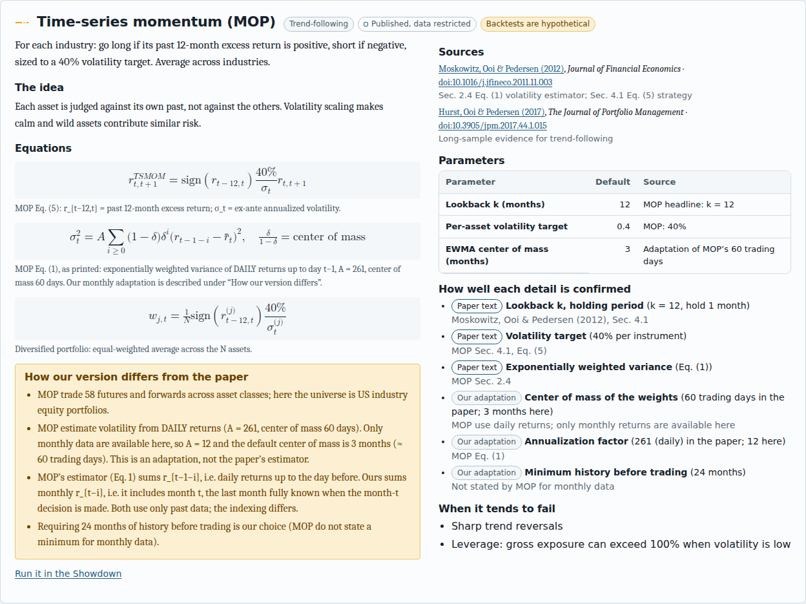</p>

### Results with their uncertainty

<p align="center">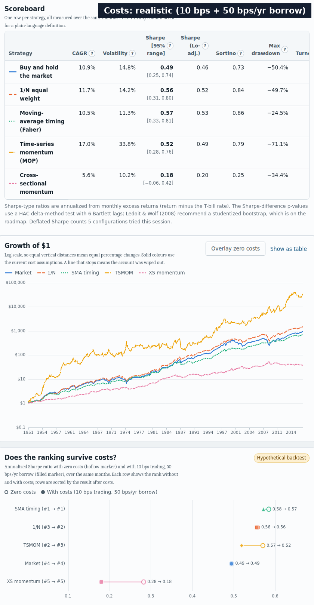</p>

What these numbers say (hypothetical, realistic costs, the 2017-vintage development copy of the data described under the hero image; the page shows them live):

- **Moving-average timing** (1951–2017 window) roughly halved the worst drawdown (−24.5% vs −50.4% for the market) at similar Sharpe. That fits Faber's paper, but the 95% intervals overlap heavily.
- **Pairs trading** (1950–2017, realistic costs) has a Sharpe ratio of about −0.6 on 12 industries checked monthly; it is negative even with zero costs. This is a monthly, industry-level adaptation, not a test of the paper's daily stock-level result.
- **Short-term reversal** (1951–2017) loses badly on industries. That agrees with secondary reports of Moskowitz & Grinblatt's finding that industries show 1-month *momentum*, not reversal.
- **Sample mean-variance** (1959–2017 window, because it needs 120 months of history) is wiped out in July 1970, when its estimated weights explode to hundreds of times leverage. This is the estimation-error problem DeMiguel et al. describe, shown rather than hidden. The exact month depends on an unverified detail: with an absolute value in the normalizing denominator (which the published version may use) the wipe-out comes in January 1971 instead.

### Is the best backtest a fluke?

The **Overfitting** page runs every setting of one strategy (for example, moving-average lengths 2–24 months) on the same months, picks the in-sample winner across all 12,870 ways of splitting the history in half, and reports the **probability of backtest overfitting** (Bailey, Borwein, López de Prado & Zhu 2017), the probability of loss, the in-sample vs out-of-sample degradation and the deflated Sharpe ratio of the best setting. It also shows why a low PBO is not a profit signal: on the development data the pairs-trading settings rank consistently (PBO ≈ 0%) yet the in-sample winner loses money out of sample in about 99% of splits.

<p align="center">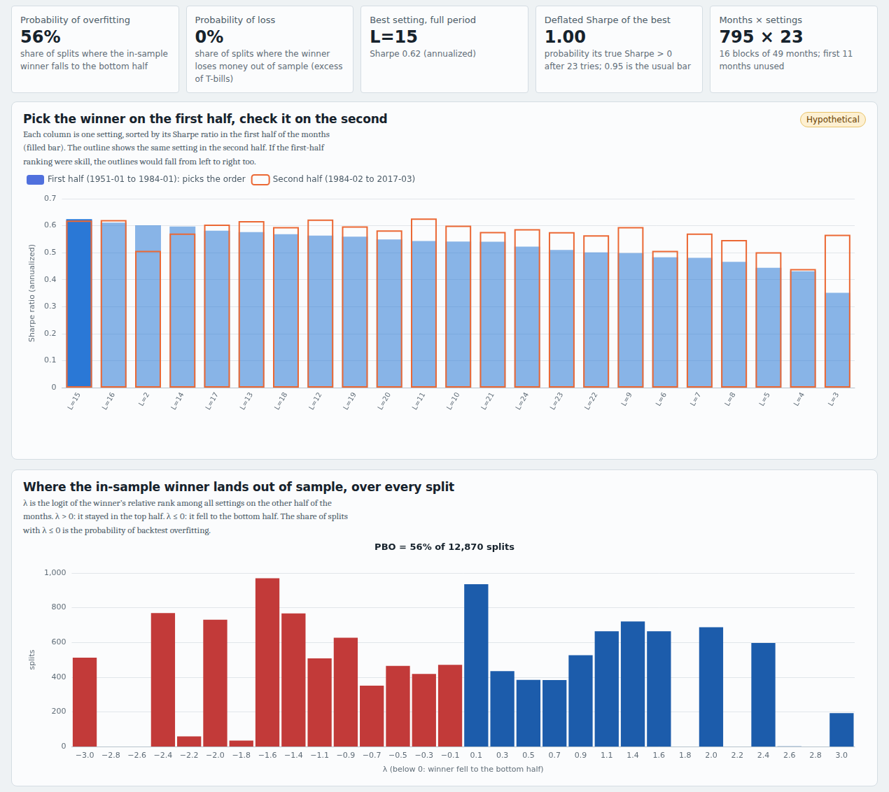</p>

*Hypothetical, realistic costs, moving-average lengths 2–24 months, 1951–2017, development copy of the French data.*

### What each strategy really holds, and how similar they are

<p align="center">
  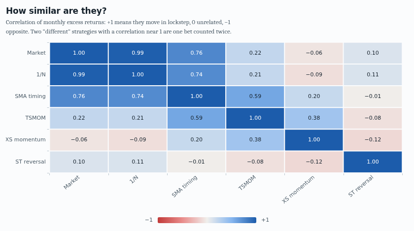
  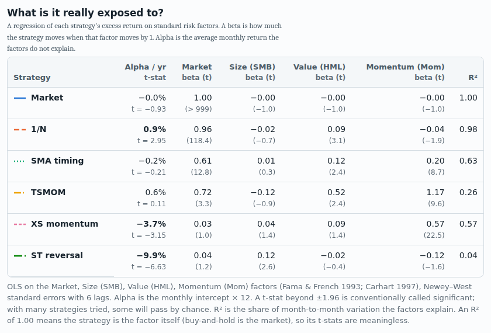
</p>

A factor regression (Fama–French + momentum, Newey–West errors) shows, for example, that cross-sectional momentum on industries loads heavily on the published momentum factor (β ≈ 0.57, t ≈ 21 in the realistic-cost run shown).

### Market making, simulated exactly as in the paper

<p align="center">
  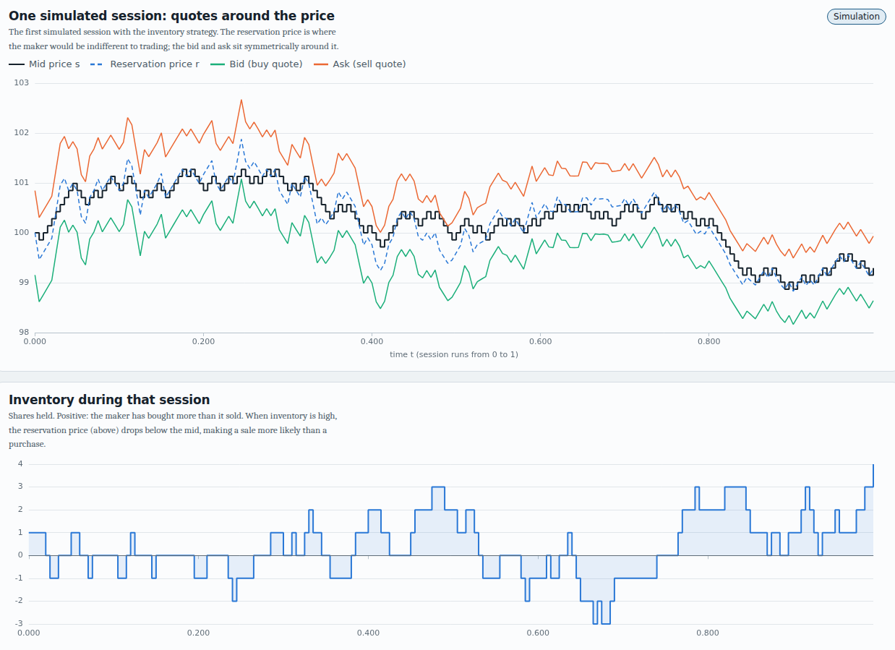
  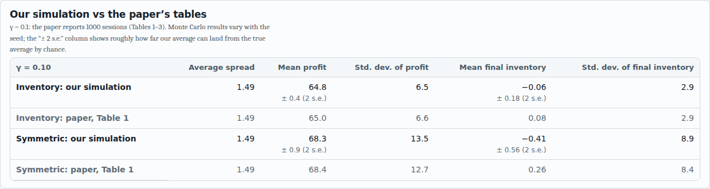
</p>

Market making can't be honestly backtested on monthly bars, because fills depend on the order book. So this page runs the **paper's own stylized market** and checks the output against its published tables. Across seeds 1, 2 and 42, every mean profit lands within 1.7 Monte Carlo standard errors of the paper and every average spread within 0.012. Profit and inventory dispersion land within about 8% (one seed reaches 14% on one row), and the γ = 1 inventory row runs a few percent low on dispersion for every seed, for a reason not yet found. The tests allow 3 standard errors on means, 0.02 on spreads and 15% on standard deviations.

## Learn how markets move

| Page | What you can do |
|---|---|
| **How markets move** | Fit six textbook return models (random walk, fat-tailed t, Merton jumps, GARCH, GJR-GARCH, regime switching) to the same history, simulate each hundreds of times, and see which of ten stylized facts (Cont 2001) each one reproduces. |
| **Market timing** | How accurate a timer must be; what missing the best or worst months does; simple timing rules side by side with a placebo test for averaged prices; lump sum vs dollar-cost averaging over every starting month. |
| **Algorithm atlas** | 25 algorithm families, from index investing to market making and order execution, each with its equation, verified sources and whether it runs here; includes an Almgren–Chriss optimal-execution simulator using the paper's own example. |
| **Terminal** | A keyboard command line over the whole engine (`run`, `compare`, `models`, `timing`, `pbo`, `cite`, `oss` …). Command names are this project's own; it is not affiliated with Bloomberg or any terminal vendor. |
| **Open source** | Open-source counterparts to market terminals (OpenBB, QuantLib, LEAN, Zipline, backtesting.py, vectorbt …) and the projects Bloomberg itself open-sources (bqplot, ipydatagrid, …), with every licence read from the project's own licence file. |

<p align="center">
  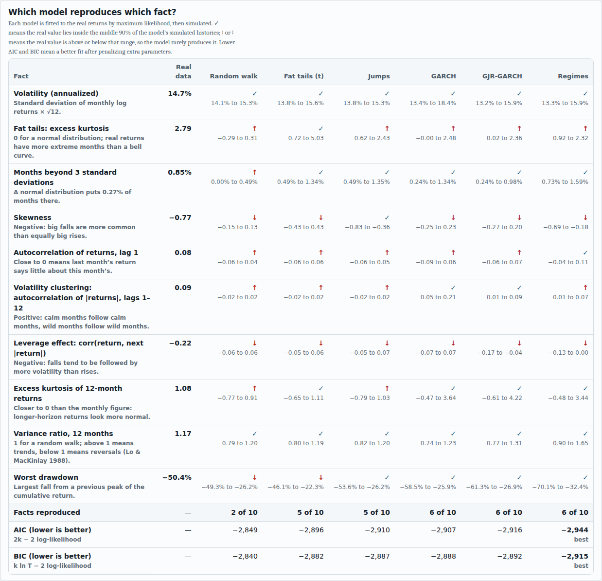
</p>

*Monthly US market returns 1949–2017 (development copy of the French data): every model reproduces the volatility, none reproduces the leverage effect, and only the GARCH-type models reproduce volatility clustering at the level seen.*

<p align="center">
  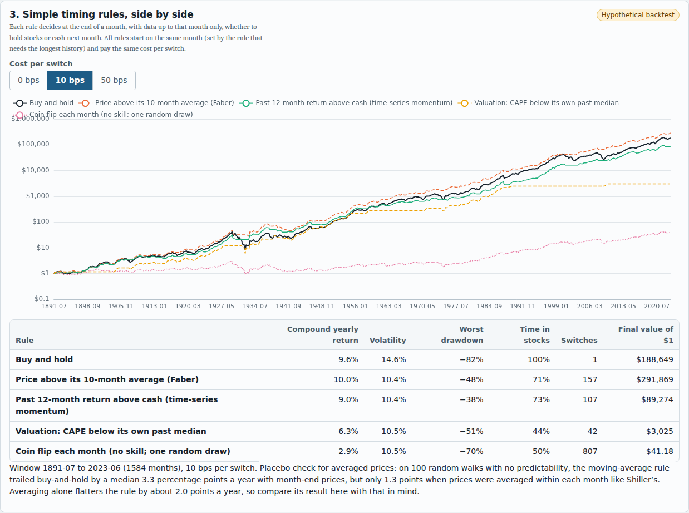
</p>

*Hypothetical, S&P Composite (Shiller) 1891–2023, 10 bps per switch, cash at 0% (the data have no short rate). The page's placebo test shows that Shiller's month-averaged prices flatter the moving-average rule by about 2 percentage points a year.*

<p align="center">
  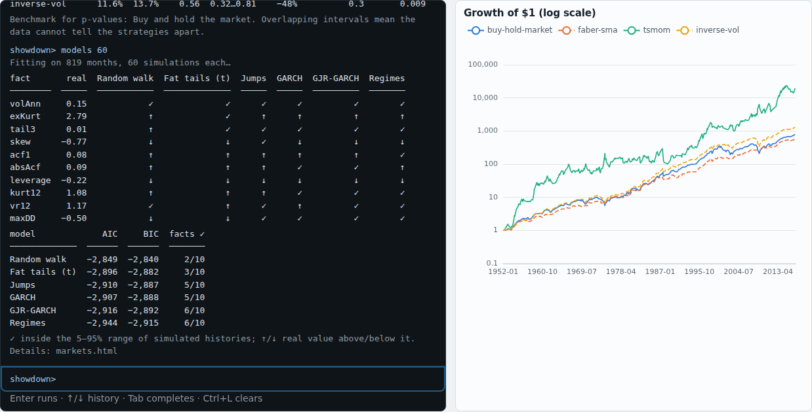
  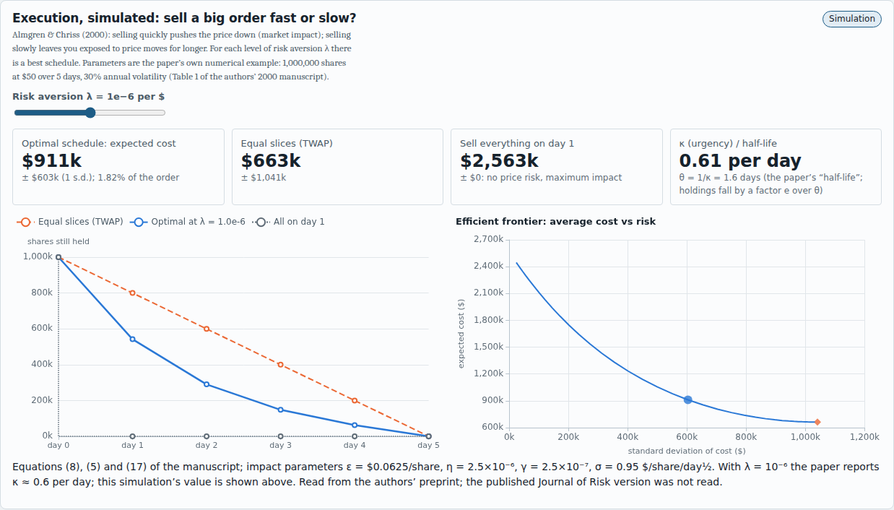
</p>

## Verification: how we know the numbers are right

| Check | Where |
|---|---|
| **Two independent implementations.** A Python reference written from [`docs/ENGINE_SPEC.md`](docs/ENGINE_SPEC.md) alone must match the JavaScript engine to relative 1e-9 on every output (returns, turnover, metrics, tests, regressions), on synthetic fixtures and on real French data (CI builds a local-only copy from the `linearmodels` package; it is never committed or deployed). | `tests/python/reference.py`, `tests/js/crosscheck.test.mjs` |
| **Published worked examples reproduced:** Deflated Sharpe 0.9004 / 0.9505 / 0.9505; minimum track record 2.73 and 4.99 years (2.83 / 3.24 are targets taken from a secondary source); Avellaneda–Stoikov Tables 1–3 within the tolerances above. Lo's η(q) is unit-tested against its formula, not against Lo's tables. | `tests/js/published.test.mjs` |
| **Overfitting tools checked:** PBO by hand on a 4-month example, ≈ 0.5 on pure noise (averaged over 30 datasets), ≈ 0 with one real edge, and JS = Python on every split of four test sweeps (S = 6–16). Pairs: hand-built divergence case and a planted mean-reverting pair. | `tests/js/overfit.test.mjs`, `tests/python/test_reference.py` |
| **No look-ahead is possible,** not merely discouraged: strategies receive arrays truncated at the decision month, and a test perturbs every future row to confirm the weights don't change. | `tests/js/properties.test.mjs` |
| **Statistical test calibration:** under a true null, the Sharpe-difference test rejects 2–9% of the time at the 5% level. | `tests/js/properties.test.mjs` |
| **Data replication:** the published momentum factor is rebuilt from French's 6 size/momentum portfolios with his formula and must match (weekly CI on live data). | `.github/workflows/live-data.yml` |
| **Models and simulations:** every estimator recovers known parameters from simulated data; a month-averaged random walk shows lag-1 autocorrelation ≈ 0.25 (Working 1960); the Almgren–Chriss closed forms and the paper's κ ≈ 0.6/day are reproduced; timing rules are checked for look-ahead by corrupting the future. | `tests/js/markets.test.mjs` |
| **Every citation resolves:** 54 DOIs checked against Crossref (title, year, first author, journal). | `scripts/check_citations.py`, `.github/workflows/citations.yml` |

What is verified and what isn't is written down parameter by parameter in [`docs/EVIDENCE_POLICY.md`](docs/EVIDENCE_POLICY.md) and on the Sources page. Open items are stated, not hidden:

- The Ledoit & Wolf (2008) bootstrap is not yet implemented; we use their HAC-style delta-method alternative.
- Moskowitz & Grinblatt's parameters come from secondary sources.
- The published RFS version of DeMiguel et al. was not read; the mean-variance formula follows their 2006 working paper.
- The Avellaneda–Stoikov γ = 1 inventory row runs a few percent low on dispersion.
- The Sortino & Price text itself was not read.

## Data: bring your own (on purpose)

The engine runs on the **Kenneth R. French Data Library** (monthly factors and industry portfolios, built from CRSP). The library publishes no redistribution license, so **this repository and its website never ship French data.** You get it yourself:

1. **Locally:** `python scripts/fetch_french.py` writes `docs/data/local/french.json` (gitignored), and the app loads it automatically.
2. **In the browser:** download the four zips listed on the page from the French library and drop them in. They are parsed locally and never uploaded.
3. **Shiller's S&P Composite (1871–2023):** the How-markets-move, Market-timing and Terminal pages fetch it on request from one pinned commit of the open-data package [datasets/s-and-p-500](https://github.com/datasets/s-and-p-500) and check its SHA-256; `python scripts/fetch_shiller.py` or the desktop app's Data menu saves a local copy. The original has no explicit licence, so it is never committed or deployed here. Shiller's prices are monthly averages and it has no short rate (cash earns 0%), which the pages state wherever it is used.
4. **Just exploring:** a **synthetic** dataset shows the mechanics under a loud "not market data" banner. It has no planted edge, so any "winner" you find is noise, which the deflated Sharpe will tell you.

> **Status:** the French CSV parser is tested on fixtures that mirror the published layout, and on real file layouts from public copies. Its first run against files downloaded live from the library happens in the weekly `live-data` CI job (this build environment couldn't reach the site).

## Run it

Three ways, all running the same code in `docs/`:

| | How | Data |
|---|---|---|
| **Website** | https://normansrule.github.io/strategy-showdown/ | Synthetic by default; drop the French library zips on the page (parsed in your browser, never uploaded) |
| **Desktop app** | Installers on the [Releases](https://github.com/Normansrule/strategy-showdown/releases) page: Windows (`-setup.exe` or `-portable.exe`), macOS (`.dmg`), Linux (`.AppImage`, `.deb`) | **Data → Download French Data Library files…** and **Download Shiller S&P Composite data…** save them on your computer only |
| **From source** | see below | `python scripts/fetch_french.py` |

The installers are **not code-signed yet**, so Windows SmartScreen ("More info → Run anyway") and macOS Gatekeeper (right-click → Open) will warn the first time. Every installer is listed in `SHA256SUMS.txt` on the release and carries a build-provenance attestation you can check with `gh attestation verify <file> -R Normansrule/strategy-showdown`.

```bash
git clone https://github.com/Normansrule/strategy-showdown.git
cd strategy-showdown
npm ci                                   # also downloads the pinned Electron binary for the desktop app
python3 -m venv .venv && . .venv/bin/activate && pip install --require-hashes -r requirements-dev.txt
python scripts/fetch_french.py           # your own local copy of the French data
python scripts/fetch_shiller.py          # and of Shiller's S&P Composite data
npm run serve -- --open                  # browser mode: 127.0.0.1 only, per-session token
npm run desktop                          # desktop window from source (Electron)
npm test && python -m pytest tests/python -q
xvfb-run -a node tests/desktop/launch.spec.mjs   # end-to-end desktop test (Linux; drop xvfb-run on a desktop)
npm run desktop:dist                     # build an installer for this OS into dist-desktop/
```

The website is static, makes no network requests beyond its own files and (only when you choose the Shiller data) one pinned, hash-checked file on GitHub, has no accounts and no analytics, and runs under a strict Content Security Policy. The local server binds to loopback only and needs a per-session token. The desktop app has no server at all: a sandboxed window loads the pages from a private `app://` scheme and every other request is blocked. See [`docs/SECURITY_MODEL.md`](docs/SECURITY_MODEL.md).

## Repository map

```
docs/                 GitHub Pages site (no build step)
  engine/             comparison engine: runner, strategies, metrics, stats, simulations, data loaders,
                      price models (models.js), timing (timing.js), execution (execution.js), PBO (overfit.js)
  assets/             page scripts, styles, images
  vendor/             ECharts 6.1.0, KaTeX 0.18.10 (with SHA256SUMS)
  data/citations.json 58 references (54 Crossref-verified DOIs)
  data/open-source.json open-source tools with licences read from each repository
  ENGINE_SPEC.md      exact semantics both implementations follow
  EVIDENCE_POLICY.md  what is verified, from where, and what isn't
desktop/server.mjs    browser mode on this computer (loopback + token)
desktop/electron/     desktop app: sandboxed window, app:// scheme, Data menu
desktop/build/        app icon for the installers
scripts/              data fetch/parse, citation checker, dev snapshot, site_chrome.py (shared nav + CSP)
tests/                JS + Python tests, fixtures, independent reference
.github/              CI, live-data replication, citations, CodeQL, Scorecard, Pages, signed releases
```

## Roadmap

- **Milestone 2 (in progress):** done: probability of backtest overfitting (CSCV) with parameter-sweep demo, distance-method pairs trading (Gatev et al.). Still to do: Ledoit–Wolf studentized block bootstrap; residual statistical arbitrage (Avellaneda & Lee 2010) on daily data; re-read the PBO paper's full text and the RFS version of Gatev et al.
- **Milestone 3 (in progress):** done: market models and stylized facts, market-timing simulations, algorithm atlas with Almgren–Chriss execution, terminal, open-source survey. Still to do: order-book and matching-engine animations; volatility targeting on daily data.
- **Milestone 4:** participant explainers built only from public filings (for example, broker SEC Rule 606 order-routing reports).
- **Milestone 5:** code-signed installers; external review of metrics and citations.

## Cite and license

MIT License © 2026 Aleksander Norman. See [`CITATION.cff`](CITATION.cff). Data: courtesy of Kenneth R. French and Robert J. Shiller; neither is redistributed here. Contributions: read [`CONTRIBUTING.md`](CONTRIBUTING.md). Evidence first.
